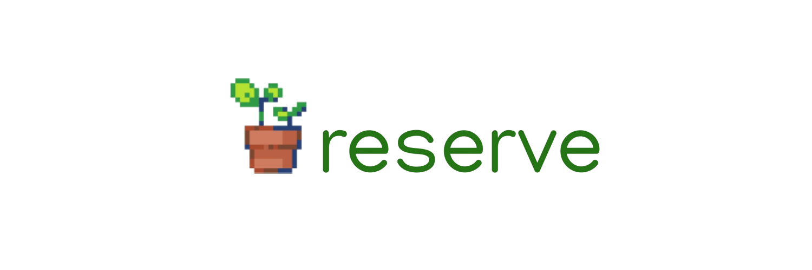

<h1 align="center">
    
</h1>

<h4 align="center"> 
	🚧  Reserve 🌱 Em desenvolvimento...  🚧
</h4>

## 💻 Sobre o projeto
O **Reserve** tem como objetivo substituir o processo manual de agendamento de salas, auditórios e veículos na UFAM.  
Projeto desenvolvido para a disciplina de Engenharia de Aplicações Web do curso de Engenharia de Software da UFAM.

## 🛠️ Tecnologias Utilizadas  
- **Backend:** Django (REST API)  
- **Frontend:** React  
- **Banco de Dados:** PostgreSQL  
- **Autenticação:** (a definir)  
- **Containerização:** Docker  


## 🚀 Como Executar o Projeto  

### 📌 Pré-requisitos  
Antes de começar, certifique-se de ter instalado:  
- [Docker](https://www.docker.com/)  
- [Docker Compose](https://docs.docker.com/compose/)  

### 🔧 Instalação e Execução  
1. Clone o repositório:  
   ```bash
   git clone https://github.com/seu-usuario/sistema-reservas.git
   cd sistema-reservas
   ```

2. Inicie o ambiente:  
   ```bash
   docker-compose up --build
   ```
3. Acesse a aplicação no navegador:  
   ```bash
   http://localhost:8000
   ```

## 📜 Licença
Este projeto é de código aberto e distribuído sob a licença MIT.
